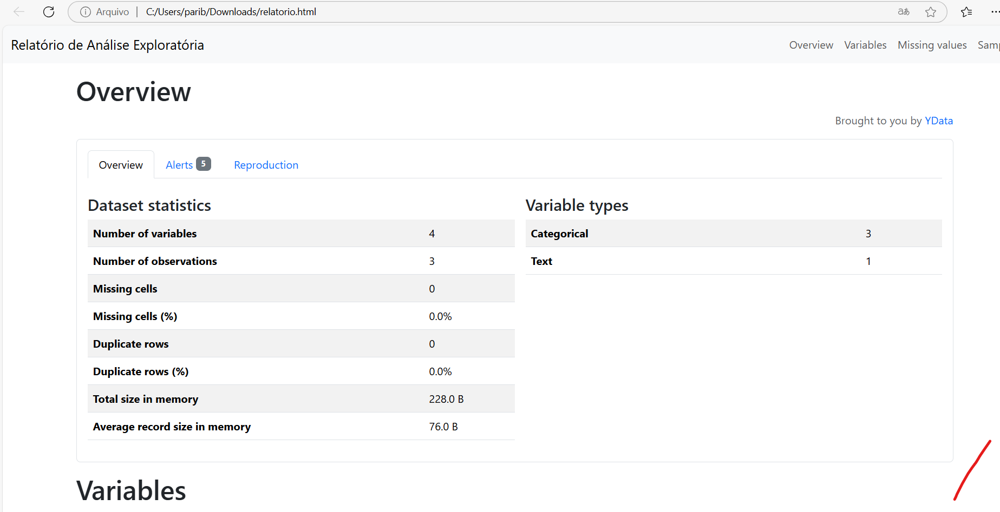

# Análise Exploratória Automatizada com ydata-profiling

Este projeto demonstra como usar a biblioteca `ydata-profiling` para realizar análise exploratória de dados (EDA) de forma automatizada em Python.

## Sobre o ydata-profiling

`ydata-profiling` (anteriormente conhecido como `pandas-profiling`) é uma biblioteca Python que gera relatórios detalhados de análise exploratória a partir de DataFrames do pandas com apenas algumas linhas de código. Ela oferece insights valiosos sobre seus dados sem a necessidade de escrever código extenso para visualizações e análises estatísticas.

## Instalação

Para instalar o pacote, use o seguinte comando:

```bash
pip install ydata-profiling

# Ou com Poetry
poetry add "ydata-profiling>=4.15.0,<5.0.0"
```

**Nota:** Para Python 3.12, certifique-se de especificar o limite de versão no `pyproject.toml`:
```toml
requires-python = ">=3.10,<3.13"
```

## Uso Básico

O exemplo abaixo demonstra como usar a biblioteca para analisar um conjunto de dados simples:

```python
# Importar as bibliotecas necessárias
import pandas as pd
from ydata_profiling import ProfileReport

# Ler o arquivo CSV
df = pd.read_csv('dados.csv', sep=';')

# Exibir o DataFrame para verificar os dados
print("DataFrame carregado:")
print(df)

# Gerar o relatório de análise
profile = ProfileReport(df, title="Relatório de Análise Exploratória")

# Salvar o relatório como HTML
profile.to_file("relatorio_analise.html")

# Para exibir em um notebook Jupyter
profile.to_notebook_iframe()
```

## Recursos Principais

O relatório gerado pelo `ydata-profiling` inclui:

- **Visão geral dos dados**: Número de variáveis, observações, valores ausentes, duplicados, etc.
- **Análise de variáveis**: Estatísticas descritivas, distribuições, valores únicos
- **Correlações**: Matrizes de correlação e heatmaps
- **Alertas**: Identificação de problemas potenciais nos dados
- **Interatividade**: Navegação fácil pelo relatório interativo

## Exportação de Relatórios

Os relatórios podem ser exportados em vários formatos:

```python
# Exportar como HTML (padrão)
profile.to_file("relatorio_analise.html")

# Exportar como JSON
profile.to_file("relatorio_analise.json")

# Exportar como PDF (requer nbconvert)
profile.to_file("relatorio_analise.pdf")
```

## Personalização

Você pode personalizar o relatório com várias opções:

```python
profile = ProfileReport(
    df,
    title="Meu Relatório Personalizado",
    explorative=True,  # Modo exploratório (mais detalhado)
    minimal=False,     # Relatório completo vs. mínimo
    correlations={
        "pearson": {"calculate": True},
        "spearman": {"calculate": True}
    }
)
```

## Integração com Jupyter Notebooks

Para visualizar o relatório diretamente em um notebook Jupyter:

```python
profile.to_notebook_iframe()
```

## Exemplo de Aplicação

Este projeto inclui um exemplo que analisa um pequeno conjunto de dados com informações de pessoas. O código:

1. Cria um arquivo CSV com dados de exemplo
2. Carrega os dados em um DataFrame
3. Gera um relatório de análise exploratória
4. Salva o relatório como HTML e exibe um resumo

## Recursos Adicionais

- [Documentação oficial do ydata-profiling](https://ydata-profiling.ydata.ai/docs/master/)
- [GitHub do projeto](https://github.com/ydataai/ydata-profiling)


Evidências:



